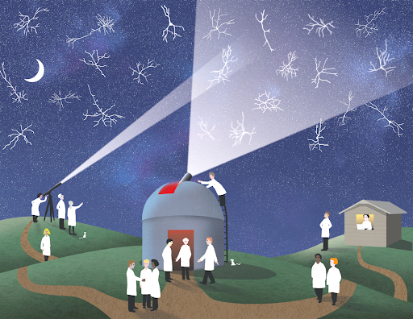

# OpenScope Databook
The OpenScope Databook is meant to store scripts and documentation used for brain data analysis and visualization, primarily working with [NWB files](https://www.nwb.org/how-to-use/) and the [DANDI archive](https://dandiarchive.org/). It is provided by the Allen Institute's **[OpenScope](https://alleninstitute.org/what-we-do/brain-science/research/mindscope-program/openscope/)** Project, an endeavor of The Allen Institute [Mindscope Program](https://alleninstitute.org/what-we-do/brain-science/research/mindscope-program/). **OpenScope** is a platform for high-throughput and reproducible neurophysiology open to external scientists to test theories of brain function. Through [Jupyter Book](https://jupyterbook.org/), this code is structured as a series of notebooks intended to explain and educate users on how to work with brain data.

We are releasing this code to the public as a tool we expect others to use. We are actively updating and maintaining this project. Issue submissions [here](https://github.com/AllenInstitute/openscope_databook/issues) are encouraged. Questions can be directed to [@rcpeene](https://github.com/rcpeene) or [@jeromelecoq](https://github.com/jeromelecoq). We are open to hearing input from users about what types of analysis and visualization might be useful for reproducible neuroscience, particularly when working with the *NWB* standard.



## How Does It Work?

Reproducible Analysis requires four components; 
- Accessible Data
- Accessible Computational Resources
- Reproducible Environment
- Documentation of Usage

The Databook leverages a number of technologies to combine those components into a web-application. 

### Data
Data is accessed from The [DANDI archive](https://dandiarchive.org/) and downloaded via the [DANDI Python API](https://dandi.readthedocs.io/en/latest/modref/index.html) within notebooks. Most notebooks make use of publically available datasets on DANDI, but for some notebooks, there is no sufficient publically-available data to demonstrate our analysis. For these, it is encouraged to use your own NWB Files that are privately stored on DANDI.

### Computation
This project utilizes [Binder](https://mybinder.org/), as the host for the environment and the provider of computational resources. Conveniently, Binder has support for effectively replicating a computational environment from a Github Repo. Users of the Databook don't have to worry about managing the environment if they prefer to use our integrated Binder functionality. However, the Databook can be run locally or on other hosts. Details about the different ways to run this code can be found in the section [How Can I Use It?](Usage) below.

### Environment
As mentioned above, Binder is capable of reproducing the environment in which to run this code. There are also other options for creating the necessary environment. Instructions for running this code locally can be found in the section [How Can I Use It?](Usage) below.

### Documentation
The great part about this Databook is that the usage of the code is explained within each notebook. The instructions found here should be sufficient for utilizing our code and accurately reproducing a number of different analyses on the relevant data.


(Usage)=
## How Can I Use It?
There are four ways to run this code. With **Binder**, with **Thebe**, **Dandihub**, or **Locally**.

### Binder
Binder will automatically setup the environment with [repo2docker](https://github.com/jupyterhub/repo2docker) and then execute the code in an instance of [JupyterHub](https://jupyter.org/hub) where the kernel is run. JupyterHub offers a lot of utilities for interacting with Jupyter notebooks and the environment. A given notebook can be launched in Binder by hovering over the `Launch` button in the top-right and selecting `Binder`. Occasionally, Binder will have to rebuild the environment before starting JupyterLab, which can take many minutes. 

### Thebe
[Thebe](https://github.com/executablebooks/thebe) uses Binder in the backend to prepare the environment and run the kernel. It allows users to run notebooks embedded directly within the Databook's web UI. It can be used by hovering over the `Launch` button in the top-right of a notebook and selecting `Live Code`. Thebe is a work-in-progress project and has room for improvement. It is also worth noting that, like Binder, starting the Jupyter Kernel can sometimes take many minutes.

### Dandihub
[Dandihub](https://hub.dandiarchive.org/) is an instance of JupyterHub hosted by DANDI. Dandihub does not automatically reproduce the environment required for these notebooks, but importantly, Dandihub allows for persistent storage of your files, so you can leave your work and come back to it later. It can be used by hovering over the `Launch` button in the top-right of a notebook and selecting `JupyterHub`. In order to run notebooks on Dandihub, you must sign in with your Github account. To set up the correct environment on Dandihub, open a `terminal` tab, navigate to the directory `openscope_databook` and run the command
```
pip install -r .binder/requirements.txt --user
```

### Locally
You can download an individual notebook by pressing the `Download` button in the top-right and selecting `.ipynb`. Alternatively, you can clone the repo to your machine and access the files there. The repo can be found by hovering over the the `Github` button in the top-right and selecting `repository`. When run locally, the environment can be replicated with our [requirements.txt](https://github.com/AllenInstitute/openscope_databook/blob/main/.binder/requirements.txt) file using the command 
```
pip install -r requirements.txt --user
```
It is recommended that this is done within a conda environment using Python 3.8 to minimize any interference with local machine environments.
From there, you can execute the notebook in Jupyter by running the following command within the repo directory;
```
Jupyter notebook
```
